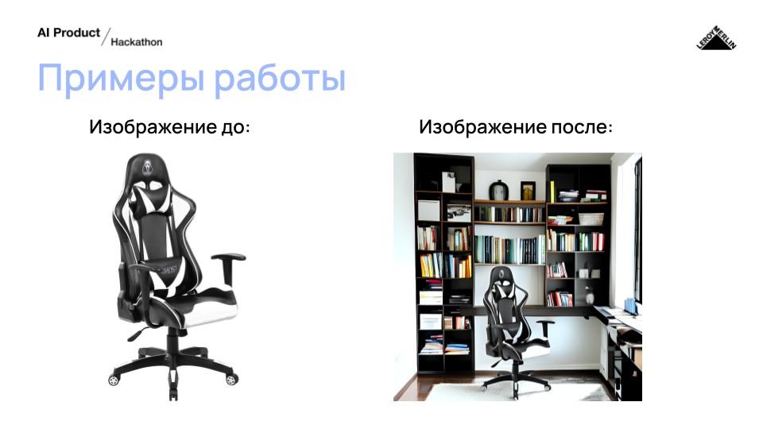
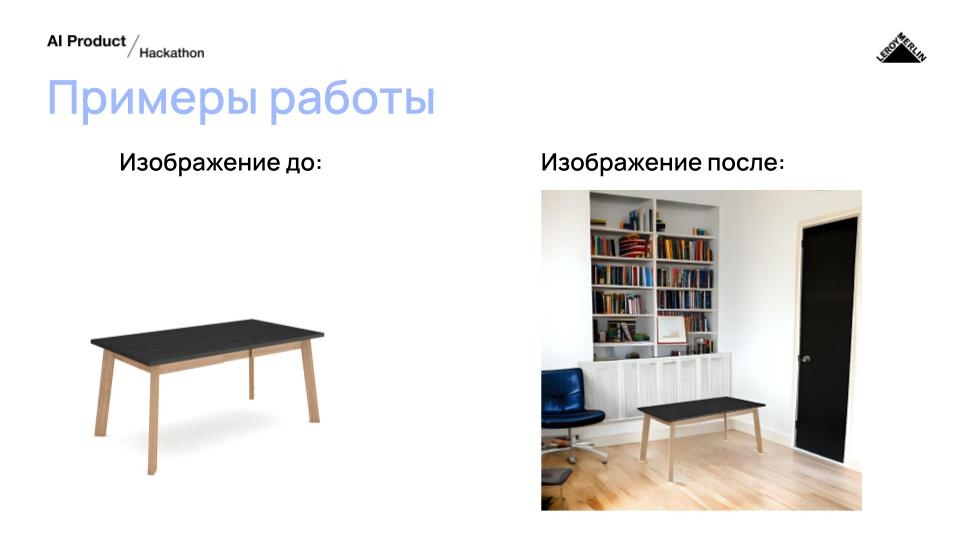

# furniture_background_generation

Repo was made on [hack](https://aiproducthack.com/). Main task of this solution - generate relevant background for a given picture of furnture.
U can read our pitch on Russian language [here](https://docs.google.com/presentation/d/1eBFZ1ewcxjLrpcgMf1f4pzLtLxheGkDLd9sxEepeI98/edit?usp=sharing)

### Working examples





[


### HardWare reqs:

Miminal working build:

1) RTX 3090
2) 16 RAM
3) Ryzen 5900x CPU
4) OS: Ubuntu

### Pipeline Build:

#### Install requirements:
```bash
conda create -n "ins_ever" python=3.10
conda activate ins_ever
pip install -r base_requirements.txt
pip install git+https://github.com/sberbank-ai/Real-ESRGAN.git
```

### Load model weights:
```bash
gdown 1LmXAzEuhVfM-DVr-1nQ7wqy2hSqeZlLL
unzip weights.zip -d weights
```

### Testing 


#### Via Telegram:

Change in the file tg_bot.py this [string](https://github.com/vaskers5/furniture_background_generation/blob/470cb1d607713400e619e628b78b6e37deb19473/tg_bot.py#L24C1-L24C24)  add here token for your's bot. And now u can taste it using telegram UI. After that run:

```
python tg_bot.py
```


#### Also u can test it using python script:

```bash
python test.py
```
